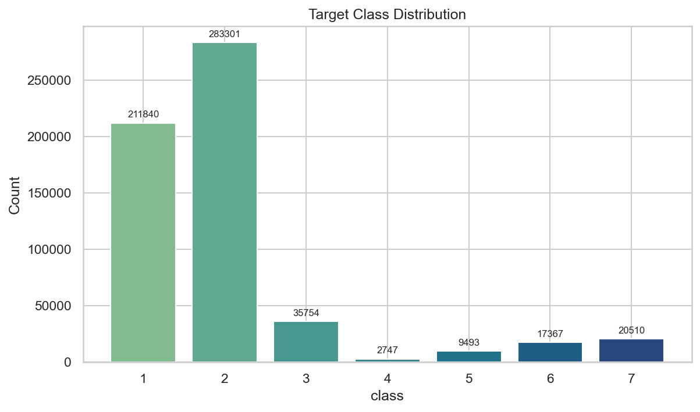
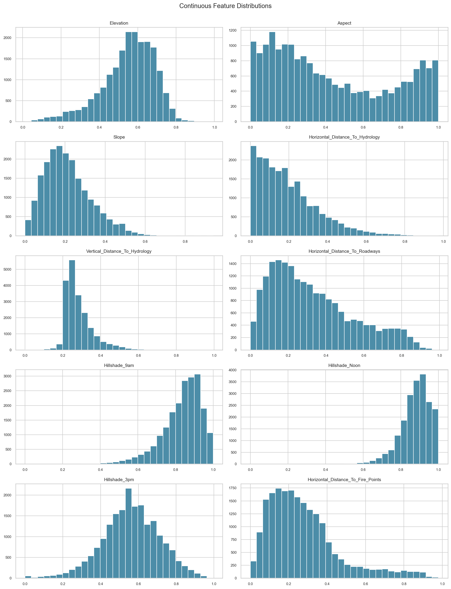
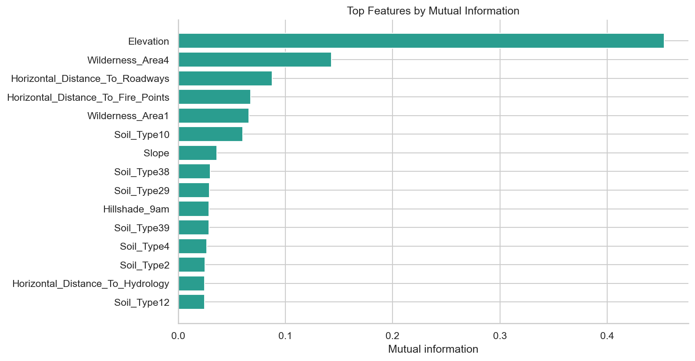
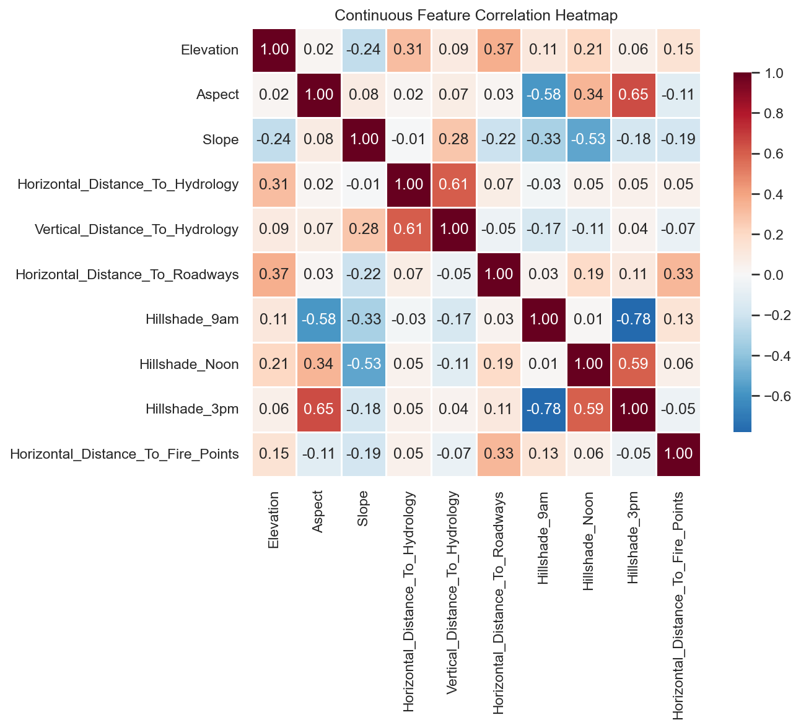
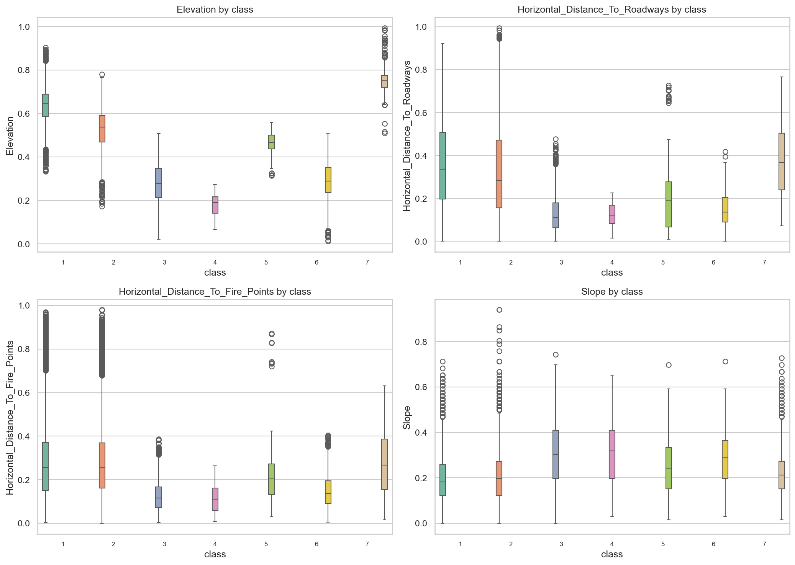
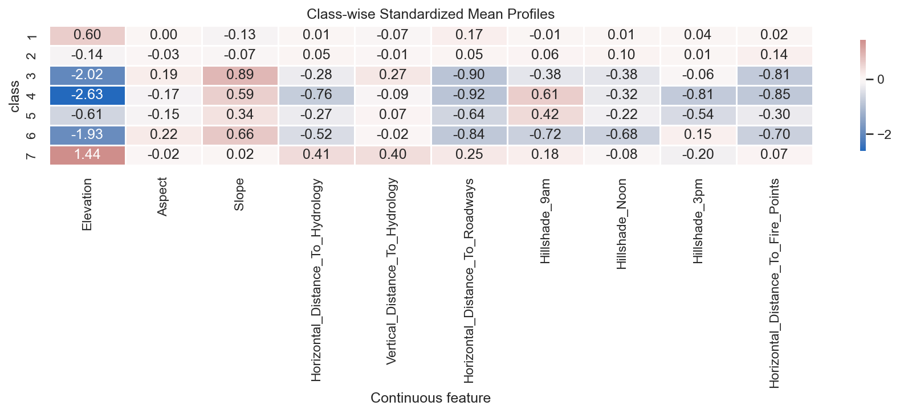
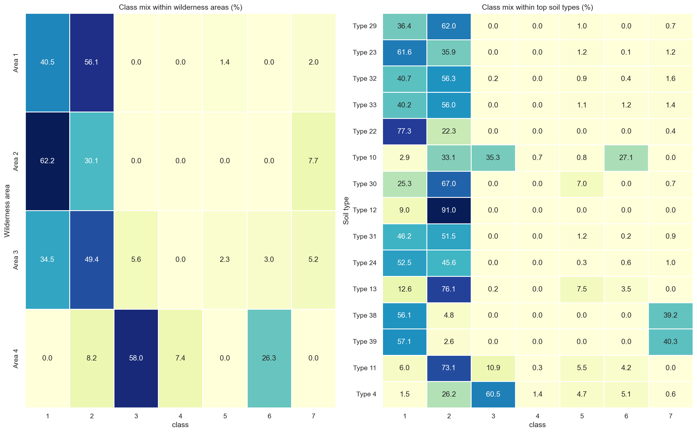

# Covertype v3 Data Exploration Report

Dataset: [OpenML Covertype v3 (dataset id 159)](https://www.openml.org/search?type=data&sort=runs&id=159&status=active)  
Generated by `src/explore.py` using the root `.venv311` environment.

---

## 1. Dataset Overview

| Metric | Value |
| --- | --- |
| Rows | 581012 |
| Columns | 55 |
| Continuous features | 10 |
| Wilderness indicators | 4 |
| Soil indicators | 40 |
| Target column | class |
| Target classes | 7 |
| Duplicate rows | 0 |
| Missing cells | 0 |
| Memory usage (MB) | 69.26 |

## 2. Column Catalogue

| Column | Dtype | Non-Null | Null% | Unique |
| --- | --- | --- | --- | --- |
| Elevation | float64 | 581012 | 0.00% | 1978 |
| Aspect | float64 | 581012 | 0.00% | 361 |
| Slope | float64 | 581012 | 0.00% | 67 |
| Horizontal_Distance_To_Hydrology | float64 | 581012 | 0.00% | 551 |
| Vertical_Distance_To_Hydrology | float64 | 581012 | 0.00% | 700 |
| Horizontal_Distance_To_Roadways | float64 | 581012 | 0.00% | 5785 |
| Hillshade_9am | float64 | 581012 | 0.00% | 207 |
| Hillshade_Noon | float64 | 581012 | 0.00% | 185 |
| Hillshade_3pm | float64 | 581012 | 0.00% | 255 |
| Horizontal_Distance_To_Fire_Points | float64 | 581012 | 0.00% | 5827 |
| Wilderness_Area1 | category | 581012 | 0.00% | 2 |
| Wilderness_Area2 | category | 581012 | 0.00% | 2 |
| Wilderness_Area3 | category | 581012 | 0.00% | 2 |
| Wilderness_Area4 | category | 581012 | 0.00% | 2 |
| Soil_Type1 | category | 581012 | 0.00% | 2 |
| Soil_Type2 | category | 581012 | 0.00% | 2 |
| Soil_Type3 | category | 581012 | 0.00% | 2 |
| Soil_Type4 | category | 581012 | 0.00% | 2 |
| Soil_Type5 | category | 581012 | 0.00% | 2 |
| Soil_Type6 | category | 581012 | 0.00% | 2 |
| Soil_Type7 | category | 581012 | 0.00% | 2 |
| Soil_Type8 | category | 581012 | 0.00% | 2 |
| Soil_Type9 | category | 581012 | 0.00% | 2 |
| Soil_Type10 | category | 581012 | 0.00% | 2 |
| Soil_Type11 | category | 581012 | 0.00% | 2 |
| Soil_Type12 | category | 581012 | 0.00% | 2 |
| Soil_Type13 | category | 581012 | 0.00% | 2 |
| Soil_Type14 | category | 581012 | 0.00% | 2 |
| Soil_Type15 | category | 581012 | 0.00% | 2 |
| Soil_Type16 | category | 581012 | 0.00% | 2 |
| Soil_Type17 | category | 581012 | 0.00% | 2 |
| Soil_Type18 | category | 581012 | 0.00% | 2 |
| Soil_Type19 | category | 581012 | 0.00% | 2 |
| Soil_Type20 | category | 581012 | 0.00% | 2 |
| Soil_Type21 | category | 581012 | 0.00% | 2 |
| Soil_Type22 | category | 581012 | 0.00% | 2 |
| Soil_Type23 | category | 581012 | 0.00% | 2 |
| Soil_Type24 | category | 581012 | 0.00% | 2 |
| Soil_Type25 | category | 581012 | 0.00% | 2 |
| Soil_Type26 | category | 581012 | 0.00% | 2 |
| Soil_Type27 | category | 581012 | 0.00% | 2 |
| Soil_Type28 | category | 581012 | 0.00% | 2 |
| Soil_Type29 | category | 581012 | 0.00% | 2 |
| Soil_Type30 | category | 581012 | 0.00% | 2 |
| Soil_Type31 | category | 581012 | 0.00% | 2 |
| Soil_Type32 | category | 581012 | 0.00% | 2 |
| Soil_Type33 | category | 581012 | 0.00% | 2 |
| Soil_Type34 | category | 581012 | 0.00% | 2 |
| Soil_Type35 | category | 581012 | 0.00% | 2 |
| Soil_Type36 | category | 581012 | 0.00% | 2 |
| Soil_Type37 | category | 581012 | 0.00% | 2 |
| Soil_Type38 | category | 581012 | 0.00% | 2 |
| Soil_Type39 | category | 581012 | 0.00% | 2 |
| Soil_Type40 | category | 581012 | 0.00% | 2 |
| class | category | 581012 | 0.00% | 7 |

## 3. Missing Values

No missing values were found in Covertype v3.

## 4. Target Distribution

- Largest class share: 48.76%
- Smallest class share: 0.47%
- Imbalance ratio (largest / smallest): 103.13

| Class | Count | Share% |
| --- | --- | --- |
| 1 | 211840 | 36.46 |
| 2 | 283301 | 48.76 |
| 3 | 35754 | 6.15 |
| 4 | 2747 | 0.47 |
| 5 | 9493 | 1.63 |
| 6 | 17367 | 2.99 |
| 7 | 20510 | 3.53 |

## 5. Training Preprocessing Policy

- `Soil_Type1` to `Soil_Type40` are collapsed into one categorical `Soil_Type` feature before encoding.
- `Wilderness_Area1` to `Wilderness_Area4` are collapsed into one categorical `Wilderness_Area` feature before encoding.
- Class rebalancing is applied only on the training split and inside cross-validation folds. Validation and test sets remain untouched.
- Majority classes `1` and `2` are randomly undersampled down to the per-class mean target count.
- Minority classes `3` to `7` are oversampled with `SMOTENC` up to the same target count.
- The rebalance target is `round(training_rows / 7)`, which keeps the final training set size approximately unchanged while flattening the class distribution.

## 6. Continuous Feature Summary

- Continuous features detected: 10
- Features bounded to [0, 1]: 10 of 10
- Histogram sample size: 20,000

| Feature | count | mean | std | min | 25% | 50% | 75% | max | skewness |
| --- | --- | --- | --- | --- | --- | --- | --- | --- | --- |
| Elevation | 581012.0 | 0.5505 | 0.1401 | 0.0 | 0.4752 | 0.5688 | 0.6523 | 1.0 | -0.8176 |
| Aspect | 581012.0 | 0.4324 | 0.3109 | 0.0 | 0.1611 | 0.3528 | 0.7222 | 1.0 | 0.4026 |
| Slope | 581012.0 | 0.2137 | 0.1135 | 0.0 | 0.1364 | 0.197 | 0.2727 | 1.0 | 0.7893 |
| Horizontal_Distance_To_Hydrology | 581012.0 | 0.1929 | 0.1521 | 0.0 | 0.0773 | 0.156 | 0.2749 | 1.0 | 1.1404 |
| Vertical_Distance_To_Hydrology | 581012.0 | 0.2835 | 0.0753 | 0.0 | 0.2326 | 0.2623 | 0.3127 | 1.0 | 1.7902 |
| Horizontal_Distance_To_Roadways | 581012.0 | 0.3302 | 0.2191 | 0.0 | 0.1554 | 0.2806 | 0.4676 | 1.0 | 0.7137 |
| Hillshade_9am | 581012.0 | 0.8352 | 0.1054 | 0.0 | 0.7795 | 0.8583 | 0.9094 | 1.0 | -1.1811 |
| Hillshade_Noon | 581012.0 | 0.8792 | 0.0778 | 0.0 | 0.8386 | 0.8898 | 0.9331 | 1.0 | -1.0631 |
| Hillshade_3pm | 581012.0 | 0.5611 | 0.1507 | 0.0 | 0.4685 | 0.563 | 0.6614 | 1.0 | -0.2771 |
| Horizontal_Distance_To_Fire_Points | 581012.0 | 0.2761 | 0.1846 | 0.0 | 0.1428 | 0.2384 | 0.3555 | 1.0 | 1.2886 |

## 7. Feature Signal

- Mutual information computed on a sample of 50,000 rows.
- Higher scores indicate more information about the target classes.

| Feature | Mutual Information |
| --- | --- |
| Elevation | 0.4533 |
| Wilderness_Area4 | 0.143 |
| Horizontal_Distance_To_Roadways | 0.0879 |
| Horizontal_Distance_To_Fire_Points | 0.0676 |
| Wilderness_Area1 | 0.0658 |
| Soil_Type10 | 0.0601 |
| Slope | 0.0362 |
| Soil_Type38 | 0.0298 |
| Soil_Type29 | 0.0291 |
| Hillshade_9am | 0.0288 |
| Soil_Type39 | 0.0286 |
| Soil_Type4 | 0.0268 |
| Soil_Type2 | 0.025 |
| Horizontal_Distance_To_Hydrology | 0.0248 |
| Soil_Type12 | 0.0245 |

## 8. Feature Relationships

### Strongest continuous-feature correlations

| Feature A | Feature B | Correlation |
| --- | --- | --- |
| Hillshade_9am | Hillshade_3pm | -0.78 |
| Aspect | Hillshade_3pm | 0.647 |
| Horizontal_Distance_To_Hydrology | Vertical_Distance_To_Hydrology | 0.606 |
| Hillshade_Noon | Hillshade_3pm | 0.594 |
| Aspect | Hillshade_9am | -0.579 |
| Slope | Hillshade_Noon | -0.527 |
| Elevation | Horizontal_Distance_To_Roadways | 0.366 |
| Aspect | Hillshade_Noon | 0.336 |
| Horizontal_Distance_To_Roadways | Horizontal_Distance_To_Fire_Points | 0.332 |
| Slope | Hillshade_9am | -0.327 |

### Continuous-feature correlations

### Top continuous features by class

### Standardized class profiles

## 9. Encoded Terrain Indicators

### Wilderness area distribution

| Wilderness_Area | Count | Share% |
| --- | --- | --- |
| Area 1 | 260796 | 44.89 |
| Area 2 | 29884 | 5.14 |
| Area 3 | 253364 | 43.61 |
| Area 4 | 36968 | 6.36 |

### Top soil types by frequency

| Soil_Type | Count | Share% |
| --- | --- | --- |
| Type 29 | 115247 | 19.84 |
| Type 23 | 57752 | 9.94 |
| Type 32 | 52519 | 9.04 |
| Type 33 | 45154 | 7.77 |
| Type 22 | 33373 | 5.74 |
| Type 10 | 32634 | 5.62 |
| Type 30 | 30170 | 5.19 |
| Type 12 | 29971 | 5.16 |
| Type 31 | 25666 | 4.42 |
| Type 24 | 21278 | 3.66 |
| Type 13 | 17431 | 3.0 |
| Type 38 | 15573 | 2.68 |
| Type 39 | 13806 | 2.38 |
| Type 11 | 12410 | 2.14 |
| Type 4 | 12396 | 2.13 |

### Class mix by derived indicator groups

## 10. Key Findings

- Covertype v3 contains 581,012 rows and 54 input features.
- The target `class` has 7 classes with a 103.13x largest-to-smallest class ratio.
- All ten continuous terrain measurements appear to be scaled to [0, 1], so the exploration reflects the normalized version of the dataset.
- Top continuous signal features by mutual information: `Elevation`, `Horizontal_Distance_To_Roadways`, `Horizontal_Distance_To_Fire_Points`.
- Top binary indicator features by mutual information: `Wilderness_Area4`, `Wilderness_Area1`, `Soil_Type10`.
- Most common wilderness area: `Area 1`.
- Most common soil type: `Type 29`.
- No missing values were detected, so preprocessing can focus on class imbalance handling, feature scaling policy, and model selection rather than imputation.
